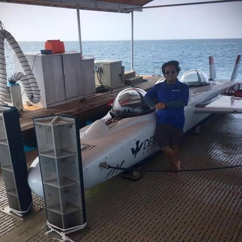

# Circuits Performers is the consulting LLC of Edwin Chiu
### Offering Mixed-Signal Electrical and Layout Consulting in Aerospace, Marine, and Sciencific fields

 
 

## Contact Information
- Email: [edwin@circuitsperformers.com](edwin@circuitsperformers.com)

## Links:
- LinkedIn: [https://www.linkedin.com/in/constructiveinterference/](https://www.linkedin.com/in/constructiveinterference/)
- GitHub: [https://github.com/inceptionev](https://github.com/inceptionev)

## Experience:

### Synthego
- 2020-Present: CRISPR gene editing instrument
  - Mainboard PCB
  - 1kV Power Supply and Management PCB
- 2014: Automated Chemical Synthesizer
  - Controller PCB

### Marine Applied Research and Exploration
- 2016-Present: BATFish Remotely-Operated Survey Submersible
  - Actuator control servo drives
  - Onsite deployment support
  

### RespiraWorks
- Founder
- 2020-Present: Full-featured, open-source ICU Ventilator
  - Controller and signal processing PCB
  - Pneumatic design
- 2021: Powered P100 Respirator (PAPR)
  - Complete design: mechanical, electrical, pneumatic
  

### Frost Methane Labs
- 2019-Preset: Remote Arctic Methane Flaring Station
  - Rugged Arctic gas sensing/satcom (Iridium) PCB
  - Thermoelectric power generation and capactitor management PCB
  

### Virgin Hyperloop
- 2019-2020: HyperloopOne Vehicle
  - Modular vehicle controller PCB      

### OpenROV
- 2019: Triton Remotely-Operated Submersible
  - Mainboard tesbed
  - Network transceiver
  

### Deepflight
- 2017-2018: Super Falcon 3s 3-passenger electric submersible
  - Dual-redundant flight computer design
  - Life support sensing and control electronics
  - Propulsion and steering control electronics
  - LiFePO4 Battery Management System
  - Shoreside battery charge electronics
- 2018: Dragon II
  - Above electronics plus:
  - LiFePO4 high voltage frontend

### Signal Laboratories
- Co-Founder, CTO
- 2014-2017: SigLabs Radio
  - Proprietary high-performance 900MHz SDR design
  - Ultra-low-SNR signal recovery algorithm
  - Naive distrbuted beamforming phase-synchronization algorithm
  

### SpaceX
- 2008-2014: Control and sensing electronics on every major vehicle in this time frame
  - Falcon 9 v1.2: Engine Controller, the first orbital booster to land vertically under its own power
  - Falcon 9 v1.1: Engine Controller, 1st Stage, the first Avionics unit to enter high-volume production
  - Falcon 9 v1.0/Dragon: Vehicle Recovery Satellite Tracker, all stages
  - Falcon 9 v1.0: Nine-Engine Start Controller
  - Falcon 9 v1.0: Data Acquisition Box
  - Dragon: Network Switch
  - Falcon 1: Experimental Satellite Communications Radio
  - All Vehicles: Sensor Input, Valve Control, Thermocouple, Thrust Vector, and Resistive Thermal Device PCB designs.
  
  
